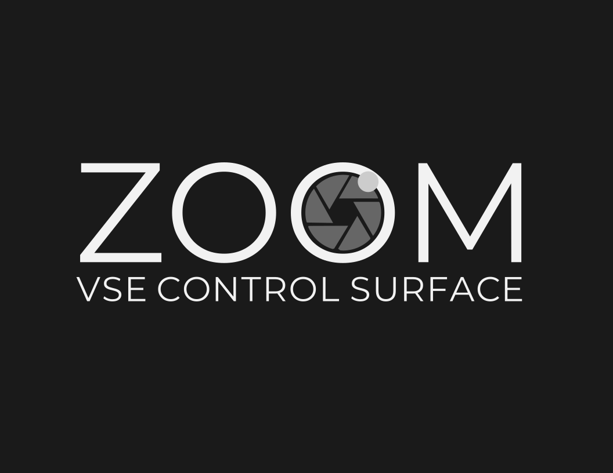

# 🎬 ZOOM for Blender VSE

### *Tactile, fast, and interactive video editing — powered by OSC.*

---

## ⚡ Overview

**ZOOM** transforms Blender’s Video Sequence Editor into a professional, tactile editing environment.
Designed for any OSC-compatible tablet app, it replaces the mouse-and-keyboard workflow with **real-time physical control** — jog, transport buttons, sliders, and macros — just like a dedicated editing console.

This is not a traditional addon.
It’s a **complete editing system** built over Blender’s engine.

---

## 🎛️ Core Features

* **OSC Control Surface Integration**
  Full two-way communication with your tablet — buttons send commands, Blender sends visual feedback (tool, timecode, states).

* **Interactive Editing Tools**
  SPLICE, INSERT, SLIP, SLIDE, GRAB, and FADE are not static actions — they respond dynamically to jog movement in real time.

* **Macro & Preset System**
  Execute complex operations (like zoom, group, ripple, or fade) with a single gesture or button.

* **Multicam Support**
  Switch between Scene stips and Camera strips on the fly.

* **Export Presets**
  One-touch render targets for YouTube, Instagram, or custom resolutions.

* **Feedback Display**
  Your control surface always shows the current tool, timeline position, and value feedback.

* **Preset System**
  Abrand New preset system to infinite posivilities.

---

## 🧠 Philosophy

ZOOM bridges Blender’s technical flexibility with the **speed and feel** of professional NLEs making Blender’s VSE accessible, intuitive, and *fast* — without removing its depth.

---

## 🧩 Requirements

* **Blender 4.5+**
* **TouchOSC** (or any OSC-capable control surface)

---

## ⚙️ Installation

1. In Blender: `Edit → Preferences → Add-ons → Install from disk...`
2. Select `ZOOM_v1.0.0-.zip`

3. Open the “OSC VSE” tab in the sidebar and set

---

## 📡 OSC Reference

A complete list of OSC messages is in `docs/OSC_Message_Reference.md`.

Example commands:

| Action       | OSC Address | Description                                 |
| ------------ | ----------- | ------------------------------------------- |
| Play / Pause | `/play`     | Toggles timeline playback                   |
| Zoom Tool    | `/zoom`     | Activates uniform scaling mode              |
| Slip Tool    | `/slip`     | Adjusts in/out points without moving strip  |
| Splice       | `/splice`   | Cuts + closes gap + enters interactive mode |

---

## 🧭 Roadmap

* 🔊 **v2:** Reaper integration for full audio workflow
* 🎚️ Standalone Android control app
* 🎞️ And a Secret game cahnger module

---

## 🧾 License

**MIT License** — free to use, modify, and distribute.
See `LICENSE.txt` for details.

---

## 🤝 Support Development

ZOOM is open-source and free on GitHub.
If you want the **ready-to-use package** (manual, OSC installer, and TouchOSC layout), grab it on Gumroad for a small contribution:

👉 [Get ZOOM Supporter Edition](https://infamedavid.gumroad.com/l/zoom)

## ZOOM Supporter Edition

A complete creative workstation for the VSE — and a way to support its ongoing development.This edition unlocks the full experience of ZOOM.
It expands the editing workflow with advanced tools, feedback integration, and camera control — everything tuned for smooth, tactile precision.

* **A multi-page TouchOSC layout with dedicated sections for tools, multicam, audio, and macros.

* **A one-click OSC installer, so setup is effortless.

* **A fully illustrated instalation guide and reference manual  to guide every feature.

* **Camera and scene tools, feedback display, and preset library for faster, more expressive editing.

* **And priority access to updates and new modules as ZOOM grows.

More than an upgrade — it’s a way to support the project and help bring tactile editing deeper into Blender.

Your support funds future development 

---

## 🧑‍💻 Credits

Developed by **Infame**
Blender, TouchOSC, and Python-OSC are trademarks of their respective owners.

---

:>
